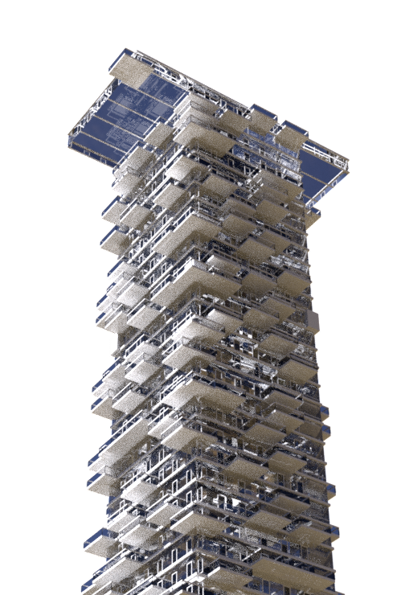
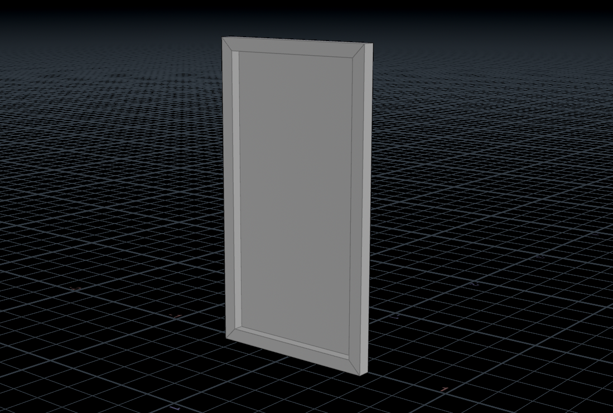
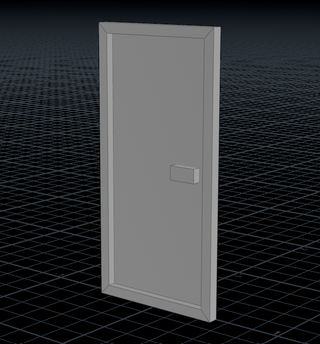
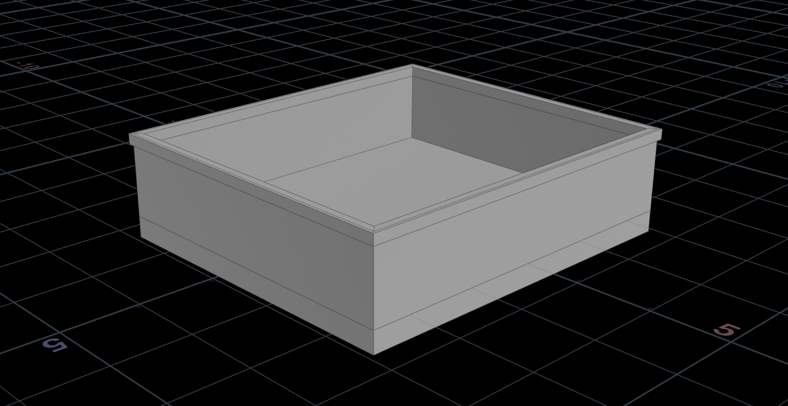
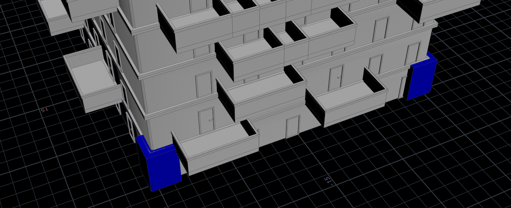
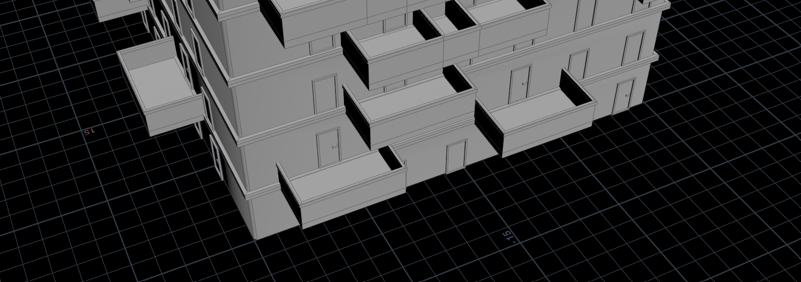
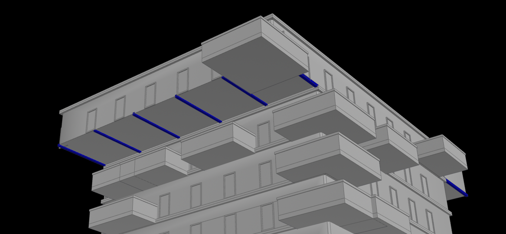
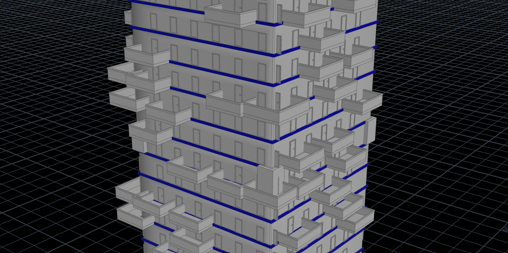

# Procedural Jenga Building in Houdini

### My Renders

  
  
  

I was inspired by **56 Leonard Street**, also known as the Jenga Building — an 821-foot skyscraper in New York City.

## Breakdown

### Windows & Doors
| Window | Door | Balcony |
|:--:|:--:|:--:|
|  |  |  |

---

### Pillars
| With Pillars | Without Pillars |
|:--:|:--:|
|  |  |

---

### Structural Details
| Beams | Borders |
|:--:|:--:|
|  |  |

### Video demos
https://github.com/user-attachments/assets/0413bebb-707b-4d02-bbb1-4ea8488e0691

https://github.com/user-attachments/assets/d18d2d63-5c62-4b79-8ec0-328dfbcf0fbd

